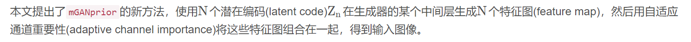
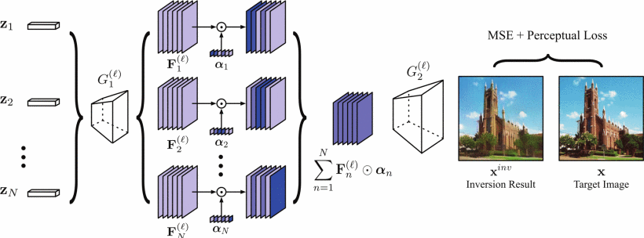
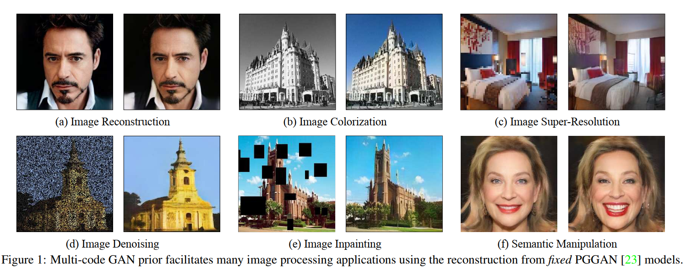

# 介紹
## P2
生成對抗網路(GAN)有很好的影像生成，主要是透過提高合成品質還有穩定的訓練過程
提出一種稱為 mGANprior 的新穎方法。使用訓練好的GAN模型進行影像處理。
具體來說，使用多個潛在碼來獲得多個生成器的中間特徵，並透過設定自適應通道重要性來重建影像。
由此產生的高保真圖像重建使經過訓練的 GAN 模型能夠優於許多實際應用，例如圖像著色、超解析度、圖像修復和語義操作。

a就是这篇论文逆推的效果，bcdef都是在逆推后达到的效果，可以看到都很不错

## P3
挑戰：

但是大多數基於GAN的方法他是許要針對特定任務，來專門設計他的網路結構或損失函數，所以限制他們的泛化能力。
經過訓練的 GAN 模型應用於實際影像處理仍然具有挑戰性，標準的GAN模型最初是為了從隨機雜訊中來合成影像而設計的，所以無法拍攝真實的影像進行任何後處理
背景就是GAN的生成能力已经非常不错，但是都是在随机噪声输入的情况下，我们的需求是对一张现有的图片进行操作，但是这个很难

1.先前的工作要通常是透過反向傳播重構誤差來直接優化潛在程式碼
2.或是透過訓練一個encoder來將圖像空間到latent space的映射(invert)。
這兩種方法的重建效果都遠非理想。 尤其是高解析度的影像更是如此
就是之前的一些方式，都不能很好的把一张真实图片逆推到GAN空间中，而且对高分辨率图片，效果更加糟糕

## P4
文中作者提出一種叫做(multi-code GAN prior,簡稱mGANprior)的方法，將已經訓練完好的GAN模型作為一種有效先驗，用於多種圖像處理任務中。
具體而言，作者在生成器(generator)的中間層用多種潛碼(multiple latent code)來產生多種特徵圖(feature map)，並透過自適應通道重要性機制(adaptive channel importance)將他們組合起來，重建輸入影像。

文中這種將潛空間過度參數化的方法大大提高了影像重建的品質，性能比現有的許多方法都要好。該方法還可以應用在影像處理的多種任務中，像圖像重建，圖像上色，圖像超分，圖像去噪，圖像修補，語義操縱等。
可以透過分別組合每層反轉潛在程式碼的特徵，進一步分析 GAN 生成器中不同層的內部表示。
论文的研究目标就是充分利用已经训好的生成器，使得GAN的逆推最优，有了好的逆推效果，就能做很不错的图片编辑

## 相關工作

### GAN Inversion
## P5
GAN 反轉的任務目標是使用預先訓練的 GAN 模型將給定影像反轉回潛在程式碼。
為了反轉 GAN 中的固定生成器
先前現有方法1. 要么基於梯度下降優化latent code潛在代碼
先前現有方法2. 要么學習額外的編碼器將圖像空間投影回潛在空間
建議使用編碼器為最佳化提供更好的初始化

However 
上述所有方法僅考慮使用單一潛在程式碼來恢復輸入影像，並且重建影像品質遠不理想，特別是當測試影像與訓練資料顯示出巨大的領域差距時。這是因為輸入影像可能不位於生成器的合成空間中，在這種情況下，不存在使用單一潛在程式碼的完美反轉。
Better
相較之下，我們建議增加潛在程式碼的數量，無論目標影像是域內還是域外，作者的實驗結果這都可以顯著提高反轉inversion品質。

### Image Processing with GANs
## P6
GAN 因其合成逼真影像的強大能力而被廣泛用於真實影像處理。這些應用包括影像去雜訊、影像修復、超解析度、影像著色、風格混合...等

However 
基於 GAN 的模型通常是為特定任務設計的，具有專門的架構或是損失函數，並透過將一張影像作為輸入、另一張圖像作為配對資料進行訓練
Better
作者的方法可以重複使用訓練有素的 GAN 模型中包含的訊息，並進一步在執行所有上述任務之前啟用單一 GAN 模型，而無需重新訓練或修改。值得注意的是，與針對特定任務專門訓練的現有基於 GAN 的方法相比，我們的方法可以取得類似甚至更好的結果。

### Deep Model Prior

## P7

本工作利用訓練好的GAN模型來進行影像處理，包括image colorization, super-resolution, image inpainting, and semantic manipulation等多個任務。具體的是，利用多個latent code從而得到多個生成器的中間特徵，並透過設定adaptive channel importance來對影像進行重構。

论文提出，单单靠一个向量去逆推，是不行的，表达能力太弱了，需要多个向量一起上，每个向量负责一小块的逆推效果，这样才能充分和真实图片近似。宏观来看，和之前的方法是差不多的，都是过生成器，然后和原图做loss，梯度反传调

使用多個潛在程式碼的 GAN 反轉過程，其產生的特徵是在某個中間層產生的
依自適應通道重要性機制(adaptive channel importance)分數加權。
所有潛在程式碼和相應的通道重要性分數聯合優化以恢復目標影像

一些工作從理論上探討了深度生成模型提供的先驗，但在實際影像處理之前使用GAN的結果仍然不令人滿意。最近的工作在語義照片處理之前應用了生成圖像，但它只能編輯輸入圖像的某些部分區域，而無法應用於著色或超解析度等其他任務。這是因為它只是將 GAN 模型反轉到某個中間特徵空間，而不是最早的隱藏空間。相較之下，我們的方法反轉了整個生成過程，即從影像空間到初始潛在空間，這支援更靈活的影像處理任務。

一个无监督、训练好的GAN可以通过从潜在空间Z中采样然后合成高质量的图像，也就是Z->image。而所谓的GAN逆映射指的是，找到一个合适Z去恢复目标图像，也就是image->Z（Z此时是一个待优化的参数）

                    

使用多個潛在程式碼的 GAN 反演流程，這些潛在程式碼的生成特徵是在某個中間層（即ℓ生成器的第 -th 層），由自適應通道重要性分數加權。所有潛在程式碼和相應的通道重要性分數被聯合優化以恢復目標影像。

<!-- ## Multi-Code GAN Prior

### GAN Inversion with Multiple Latent Codes
單一潛在程式碼的表現力可能不足以恢復某個影像的所有細節，所以作者介紹如何利用多個潛在程式碼進行 GAN 反轉 -->

#### Feature Composition
## P8
因此，我們建議透過組合潛在代碼的中間特徵圖。更具體地說，生成器G ( · )分為兩個子網絡G1, G2

把生成器劈成两半，多个向量过G1后生成很多个中间特征，这个是第一步

ℓ 是中間層進行特徵合成的索引。
有了這樣的分離，對於任何zn，我們可以得到對應的空間特徵F( ℓ )n=G( ℓ )1（zn） 以便進一步組合。

#### Adaptive Channel Importance
## P9
我們希望每個zn恢復目標影像的某些特定區域。

那透過先前其他的論文當中觀察到GAN中生成器的不同單元（即通道）負責產生不同的視覺概念，例如物件和紋理。

作者引入了自適應通道重要性αn對於每個zn幫助他們適應不同的語意。期望每個條目αn來表示特徵圖對應通道的重要程度F( ℓ )n是。透過這樣的組合，可以產生重建影像

就是引入一个通道权值，每个中间特征的通道上都赋了权重，然后把带了权重的特征加在一起给G2，输出的就是逆推后的效果

#### Optimization Objective
## P10
讲一下怎么优化，优化目标是多个输入z，还有对应的权值，优化函数是图片的L2loss和vgg 的loss，这个loss反传去优化。整个过程没有网络，只是一个简单的优化过程。

在引入特徵合成技術以及引入的自適應通道重要性來整合多個潛在代碼之後，總共有2N組參數需要最佳化。因此，我們重新表述方程式

第一個公式 最终整个框架是求解Z和α

為了提高重建質量，我們透過利用低層和高層資訊來定義目標函數。特別是，我們使用逐像素重建誤差以及我1從兩個影像2中提取的感知特徵[22]之間的距離。

第二個公式 重建损失使用的是MSE和VGG的感知损失距离：

### Multi-Code GAN Prior for Image Processing
## P11
除了可以逆推原图，作者还发现，对于图片上色，超分，图片修补等，修改优化函数后都能得到很不错的结果

反演後，我們將重建結果套用為多程式碼 GAN，然後再執行各種影像處理任務。每個任務都需要一張影像作為參考，這是要處理的輸入影像。

例如，影像著色任務處理灰階影像，影像修復任務恢復缺失孔的影像

給定一個輸入，我們應用所提出的多碼 GAN 反轉方法來重建它，然後對重建影像進行後處理以近似輸入。當近似值夠接近輸入時，我們假設後處理之前的重建就是我們想要的。在這裡，為了使 mGANprior 適應特定任務，我們修改了方程式

對於影像超解析度任務，使用低解析度影像ILR作為輸入，我們對反演結果進行下採樣以近似ILR

對於影像修復任務，具有完整的影像我或者我和一個二進制掩碼米指示已知像素，我們只重建未損壞的部分，並讓 GAN 模型自動填入缺少的像素

#### 實驗
## P12
首先说一下逆推原图的效果，第一行是原图，方法a是只用一个向量去逆推，方法b是学习一个encoder来逆推，方法c是a和b的结合，方法d是本文的方法，可以看到在定量和定性上的效果，本文的效果都是最好的

PSNR是一种客观的图像质量评估方法，其基本思想是通过比较原始图像和失真图像之间的均方误差来衡量图像质量。PSNR值越高，说明失真越小，图像质量越高。PSNR的计算公式为：

LPIPS是一种基于深度学习的图像质量评估方法。该方法通过训练一个深度神经网络来模拟人类视觉系统对图像的感知，从而对图像质量进行评估。LPIPS算法的核心思想是基于感知学习，即通过训练一个深度神经网络，使其能够对人类视觉感知的特征进行模拟和学习，并基于这些特征来评估图像质量。
优点：LPIPS指标能够很好地模拟人类视觉系统对图像的感知，对细节和纹理的失真较为敏感。同时，该方法具有较好的泛化能力，可以对不同场景下的图像质量进行评估。
缺点：LPIPS指标需要大量的训练数据和计算资源，训练时间和成本较高。同时，该方法对于一些复杂的失真类型可能不够敏感，需要进一步优化和改进。

## P13
然后是文章的一个消融实验，我们先竖着看，发现输入向量的个数不是越多越好的，多到一定程度，效果就提不上去了，这说明在优化空间的维数和逆推的效果之间存在trade-off的，y轴是逆推图片和真实图片的相关性大小。然后横着看，发现逆推的效果随着生成器切分层序列的增加呈现上升趋势，在第四层后变化不明显。

## P14
第二个应用是超分，输入一张低分辨率图片，可以看到效果还是非常不错的

新的模型称之为NIQE(Natural Image Quality Evaluator),这个模型的设计思路是基于构建一系列的用于衡量图像质量的特征，并且将这些特征用于拟合一个多元的高斯模型，这些特征是从一些简单并且高度规则的自然景观中提取

## P15

第三个应用是图像修补，给定图片和掩码，能回复出原图，从指标上看还是非常不错的

SSIM
全名為structural similarity (結構相似性），主要是比較圖片之間的亮度、對比度、結構。首先來定義這三者。
## P16
实验的最后是一个解释性，我们发现对于这样一张卧室的图片，用人脸集，教堂集训出来的模型也能逆推，且生成器切分层的索引越大，效果越好，但我们也要看到，对于卧室集训出的模型，在第四层就已经效果非常好了，但是其他集就算第八层也一般般，这其实也能解释。因为卧室和人脸等的语义是不一样的，所以在人脸模型在浅层的一些高级特征没法生成卧室的图片，但是随着网络加深，深层的低级特征，比如像素等，是可以粗略组合出卧室的图片的

## P17
然后是结论，就是更多的参数，能达到更好的逆推效果，同时这个方法也能有很多的图片编辑应用
mGANprior 使用多個潛在程式碼透過預先訓練的 GAN 模型重建真實影像。它使這些 GAN 模型在各種圖像處理任務之前變得強大。
除此之外，延伸一個問題对于不足，我觉得是参数太多了，逆推会非常非常慢

## 備註

Image Processing Using Multi-Code GAN Prior, CVPR 2020

